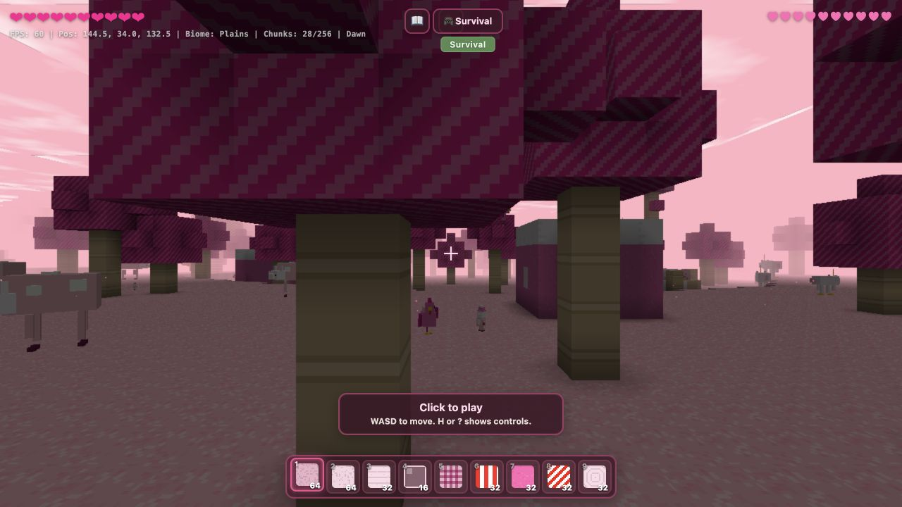

# Phase 1 — Safety Net and Baseline

Captured 2026-07-10 before visual implementation changes.

## Environment

- Browser viewport: 1280 × 720 CSS pixels
- Browser device pixel ratio: 2
- Baseline WebGL backing buffer: 1280 × 720 pixels
- Baseline visible FPS indicator: 60 FPS
- Visible chunks in representative spawn scene: 28 / 256
- Console warnings/errors after settled load: none
- Syntax check before changes: passed (`node --check js/*.js`)
- Test baseline before changes: zero tests (`node --test` reported 0)

## Visual baseline

The screenshot records the unchanged project at its existing spawn. It shows the
soft DPR-1 backing buffer on a DPR-2 display, a partially obstructed spawn view,
continuous debug text, emoji controls, and the current flat directional lighting.

## Added safety net

`test/core.test.js` protects browser-neutral seams for deterministic random streams,
atomic inventory transactions, shaped and mirrored recipe matching, idempotent save
migration chains, and capped fixed-step accumulation. The suite uses only Node's
built-in test runner and introduces no build or runtime dependency.

## Performance budget

The baseline target remains 60 Hz. Implementation phases use 16.67 ms as the median
frame budget, with representative-scene p95 kept under 22 ms and heavy weather or
entity scenes no more than 10% slower than their same-location clear baseline.
